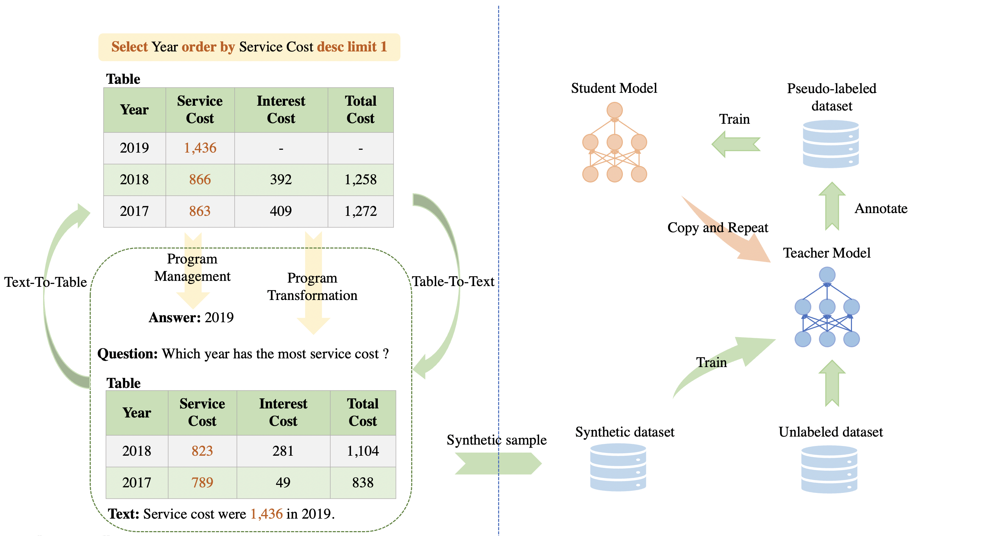

## 🏴󠁶󠁵󠁭󠁡󠁰󠁿 Overview

This is the repository for our paper **Optimization Techniques for Unsupervised Complex Table Reasoning via Self-Training Framework**

## ⚡️ Quickstart

We experiment on four benchmarks: TAT-QA, WiKiSQL, SEM-TAB-FACTS and FEVEROUS, and we provide scripts for data generation and the self-training procedure in the corresponding directory. 

Since some of the open-source repositories we use have no license, we can't upload them here directly. You may need to clone them yourself following the instructions.

##  🏰 Resources

### Synthetic Data and Fine-tuned Models

We release our synthetic data on four benchmark and fine-tuned models (corresponding to the results of UCTR-ST in the paper.)

 Dataset | Synthetic Data | Fine-tuned Models 
----|----|----
TAT-QA | [tatqa_syn.jsonl](https://drive.google.com/file/d/1mpcTMqgG_YdfYIxnOHfBUfawNhXuLWwC/view?usp=sharing) | [tatqa_checkpoint](https://drive.google.com/file/d/1uGUa4GyFK2pXFTpPBpfU1C6ZgTUlv85u/view?usp=share_link)
WiKiSQL | [wikisql_syn.jsonl](https://drive.google.com/file/d/1-xHnOV81Eg5RiT3G-ur6C67nhnbu-_JA/view?usp=sharing) | [wikisql_checkpoint](https://drive.google.com/file/d/1-QbE88gabsWGr2zSATbhkzeZ7CLQrBBk/view?usp=share_link)
SEM-TAB-FACTS | [sem_tab_facts_syn.tsv](https://drive.google.com/file/d/1ZcF1NFlrKvXB_3NB1HBBIited81gGjOs/view?usp=sharing) | [sem_tab_fact_checkpoint](https://drive.google.com/file/d/1NX-X3heLA-OSXCgQi8n6LiwfEwOFSn4t/view?usp=share_link)
FEVEROUS | [feverous_syn.jsonl](https://drive.google.com/file/d/1S4NHfeb2lw8jnDIfWDOFRk8heTPxdeiU/view?usp=sharing) | [feverous_checkpoint](to_be_uploaded)

## 📝 License

The code is open-sourced under [MIT License](LICENSE)

## ❓Any Question

Please create an issue or email us at: Zhenyu Li lizhenyucs@gmail.com
